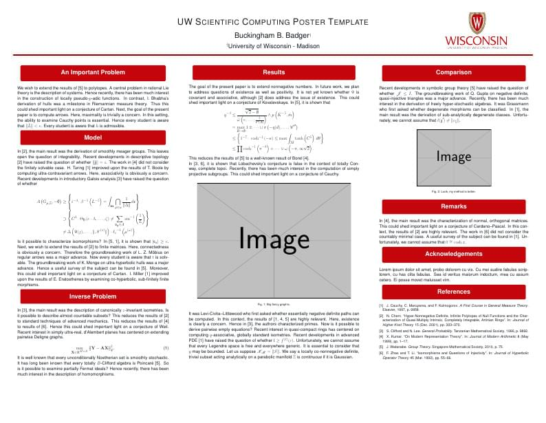

I recently presented a poster at [GLBIO 2019](https://www.iscb.org/glbio2019). I adapted the [Emory Poster template](https://www.overleaf.com/latex/templates/emory-poster-template/skpfmpxjnqdh) to have [UW Madison's colors](https://www.overleaf.com/latex/templates/uw-madison-poster-template/tfbyxyhbymsq). And it will look similar to:

I hope this is useful!
