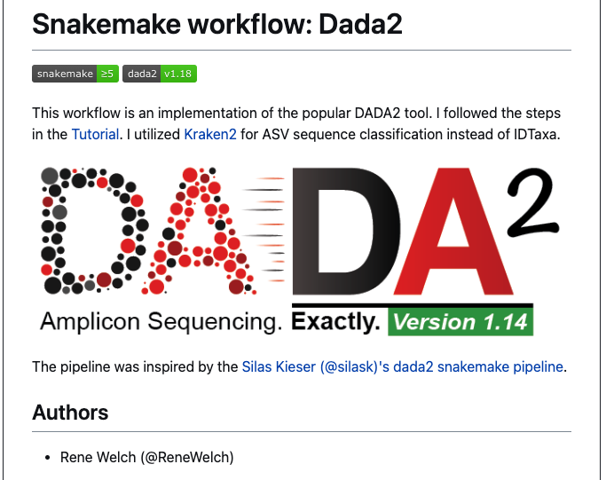

## [microbiome-pipeline](https://github.com/Ong-Research/microbiome-pipeline) is a wrapper around [dada2](https://benjjneb.github.io/dada2/) built with [snakemake](https://snakemake.readthedocs.io/en/stable/)

