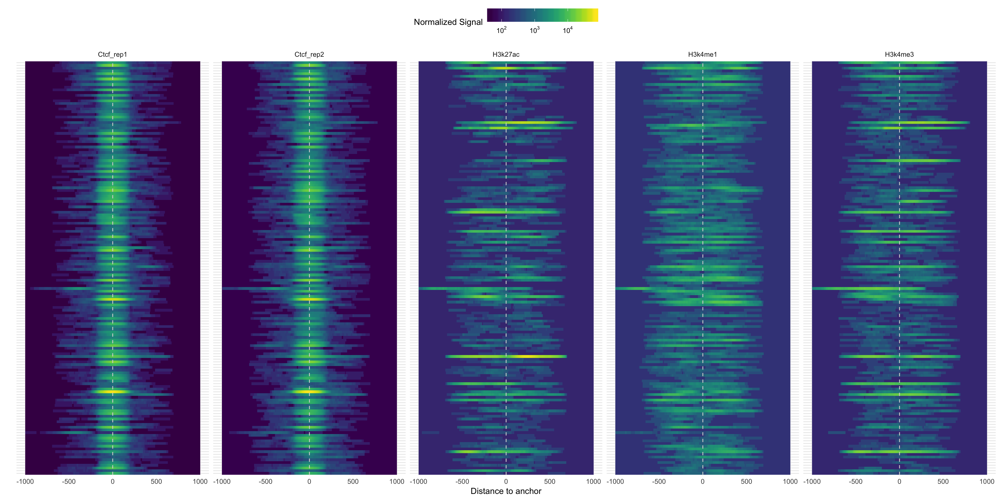

## [Segvis](https://github.com/welch16/Segvis) is a package to visualize genomic data around genomic regions.

An R package to visualize ChIP-seq experiments across a set of pre-defined peaks. The package requires a set of pre-defined genomic regions, and aligned reads in bam format. We can do many tasks with it, some examples are:

* Extracts read data of specified input regions
* Plot peaks of different conditions across the same set of regions
* Plot central measures for a set of regions with the same width
* Subset regions according to used defined annotations
* Plot the heatmap of signal curves accross regions separated by annotation

The package is available [here](https://github.com/welch16/Segvis)

The image below was generated with `Segvis`, and it shows the CTCF and histone experiments signal around the CTCF peaks' summits.

