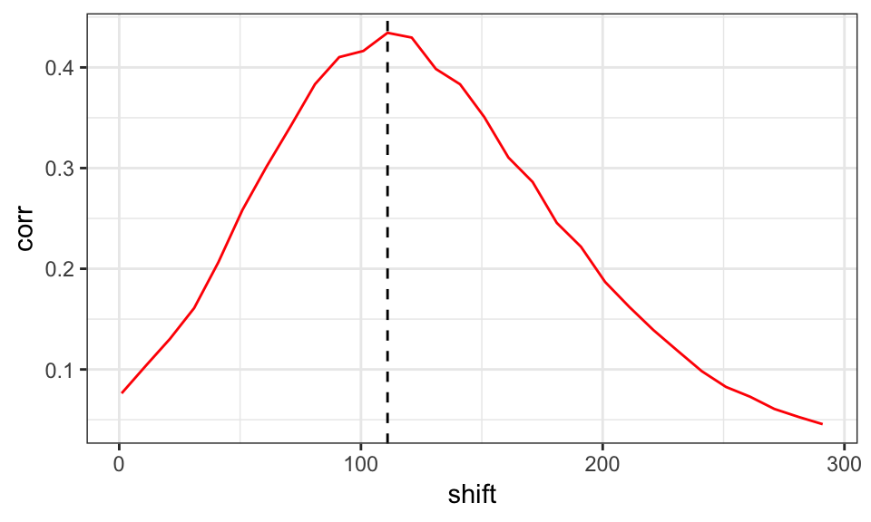

## [ChIPUtils](https://github.com/welch16/ChIPUtils) is an R package that contains many functions used for exploratory analysis of ChIP-seq and ChIP-exo data.

It includes some commonly used quality control measures:

* PCR bottleneck coefficient (PBC)
* Strand cross-correlation (SCC)

Below, I show an example of the SCC computed with **ChIPUtils**

